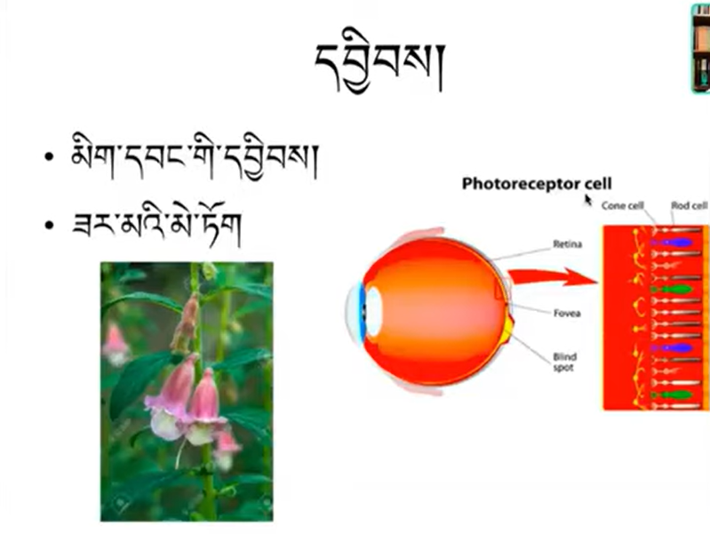

# Additional material for reference

## Eye sense power

It is possible the subtle form of the eye sense power refers to the rods and cones within the eye's photoreceptor cells, described as being shaped like a flower. Here is a diagram.

* The ear sense power (faculty) has a shape resembling tree roots. Similar to the eye sense power (faculty), it's clear and reflects its object.
* The nose sense power has a shape like thousands of bronze needles.
* The tongue sense power has a shape like a crescent moon or a sickle.
* The tactile sense power has a shape that resembles our skin, covering and forming the shape of our human body. That is what is called the body faculty.

## Table of objects

A table of example consciousnesses and their respective objects

[Table of Objects (PDF)](assets/AK_Chart_Objects_ObjectPossessors_ILTK_BP.pdf)